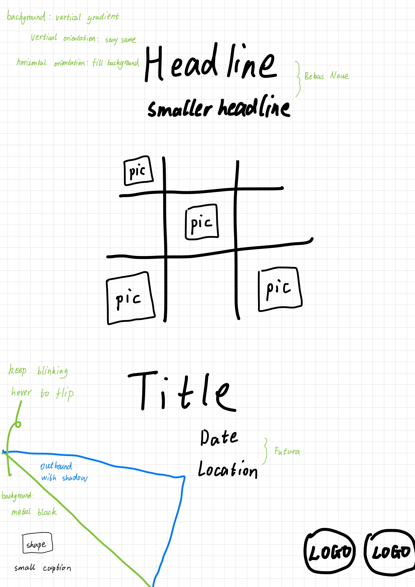
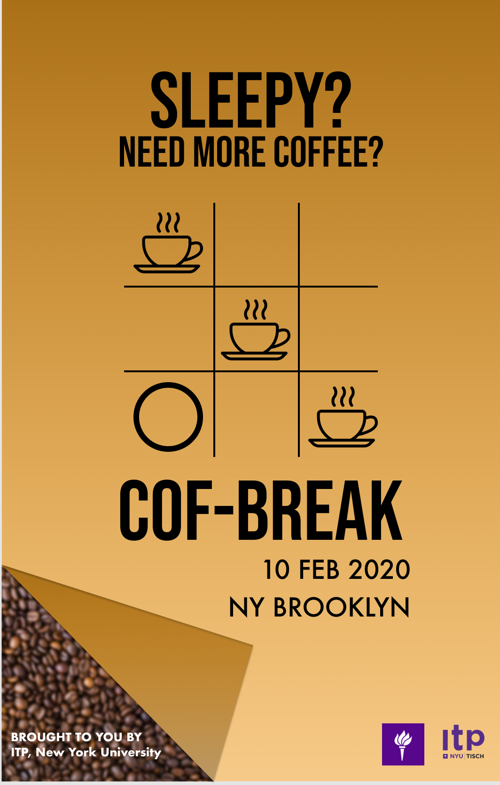
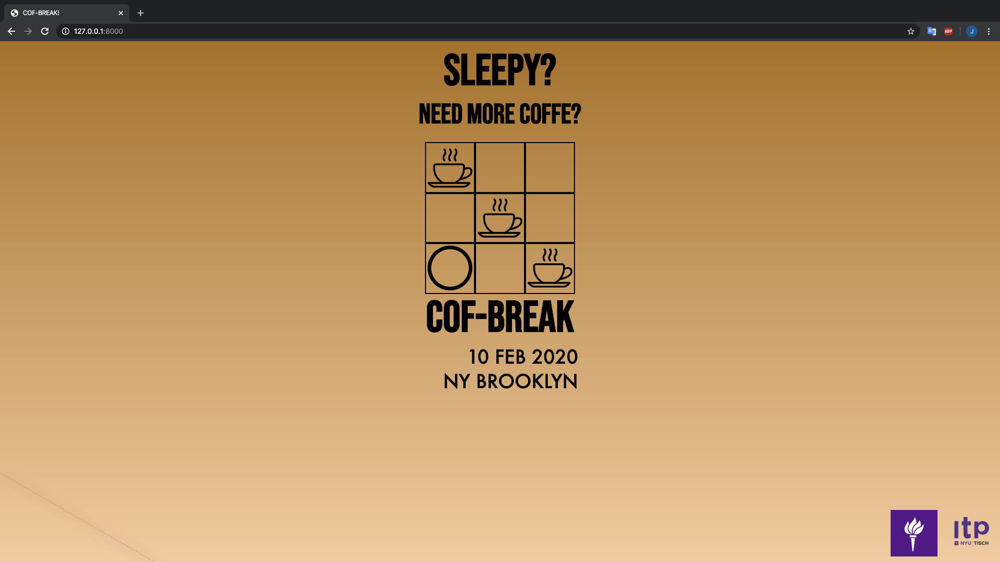

# Reproduction of a Poster - Interactively

This is a website reproducing [Ar Qiu](http://www.studentshow.com/arqiu)'s poster and turned it into an interactive format.

> This is the poster for reproduction. [link to the concept](http://www.studentshow.com/gallery/Poster-design-(concept)-Ebazaar/11973239)

For now the interaction is to move the mouse over the left corner and the page will tuck up a little.

## About

This poster is designed for a food event. To reproduce this, I add some other animation such as flipping the corner, changing the background color by clicking on the dish.

## Built with

* [VS Code](https://code.visualstudio.com/)
* [Github](https://github.com)

## Authors

* [Ar Qiu](http://www.studentshow.com/arqiu)
* [Yongkun Li](www.jonysandyk.com)

---

# Notes & Process

## Process & Documentation

### Sketch & Wireframe

Here's the structure of this webpage:
 
> Page sketch

Then I built the wireframe using Figma as following:
 
> Wireframe of the poster, [link](https://www.figma.com/file/lJcYj0kDqFvU55qRqGiSma/Reproduction-of-a-Poster?node-id=0%3A1) here

Finally, I implemented the webpage and here it is!
 
> Final page on desktop

## Challenges & Struggles

The main challenge are all about alignment, as some of the elements should be aligned center and some to the very corner of the page. The process of searching online about methods to solve did let me learn a lot about the structure of HTML page.

In the future I may continue polishing the page to make it more compatitable to multi devices.

## Questions

- How to add shadow to the border without showing the border? (only shows the shadow)
- How to draw grids with customizable border? (like in my page I didn't make the central grid the same as the sketch)

## References

* Ar, Qiu. [Link](http://www.studentshow.com/arqiu)
